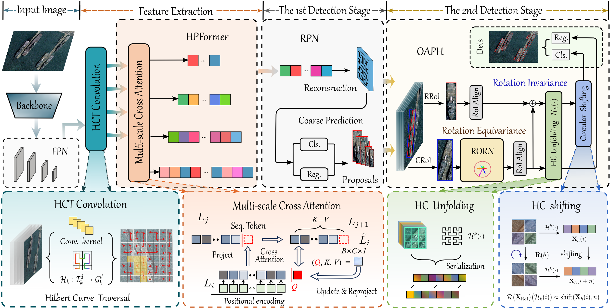

# HERO-Det: Hilbert Curve-Encoded Rotation-Equivariant Oriented Object Detector



## Introduction 
This repository is the official implementation of “Hilbert Curve-Encoded Rotation-Equivariant Oriented Object Detector with Locality-Preserving Spatial Mapping”, built upon the MMRotate/MMDetection ecosystem.

## What's New 
- Add HERO codebase and config for DOTA multi-scale training :alarm_clock: **2025-11-11**
- Provide Hilbert-based sequence transforms and cyclic-shift fusion module :alarm_clock: **2025-11-11**

## Results and Models

| Model |  mAP  | Angle | lr schd | Batch Size |                         Configs                          |          Download          |
| :---: |:-----:| :---: | :-----: |:----------:|:--------------------------------------------------------:|:--------------------------:|
| HERO (ResNet-50, FPN) | 79.56 | le90 | 3x |     4      | [HERO-3x](configs/_HERO/HERO_le90_r50_fpn_3x_dota-ms.py) | [TBD](LINK_TO_BE_UPLOADED) | [log](LINK_TO_LOG) |

Notes:
- We will release checkpoints soon. You can place your files in `tools/model_weight/` and update the links above.

## Overall Architecture
1) FPN features are flattened to 1D sequences via Hilbert mapping (H×W → L)  
2) Optional cross-scale fusion using cross-attention over the sequences  
3) Hilbert-Conv1D processes sequences before RPN classification/regression  
4) RoI extractor outputs rotated (8×8) and horizontal (hor_size×hor_size) features  
5) RoI head: rotated features for classification; horizontal features for regression; optional ORN enhancement

## Code Structure
- RPN head (Hilbert sequence modeling)
  - `mmrotate/models/dense_heads/hilbert_rpn_head.py`
- RoI extraction (RRoI + horizontal RoI)
  - `mmrotate/models/roi_heads/roi_extractors/rotate_single_level_Hroi_and_Rroi_extractor.py`
- RoI head (classification + regression)
  - `mmrotate/models/roi_heads/bbox_heads/hilbert_convfc_rbbox_head.py`
- HERO utilities
  - `projects/HERO/hero/HPFormer.py` — Hilbert/Row-Major/Snake/Morton/Peano transforms (flatten/unflatten)
  - `projects/HERO/hero/hilbert_cross_attention.py` — cross-scale attention for sequences
  - `projects/HERO/hero/hilbert_cyclic_shift.py`, `projects/HERO/hero/cyclic_shift_direct.py` — rotation simulation
  - `projects/HERO/hero/cyclic_shift_methods.py` — rotation-aware fusion modules
  - `projects/HERO/hero/ResidualORN.py` — residual ORN module

## Installation
```bash
conda create -n hero python=3.10 -y
conda activate hero
pip install -r requirements.txt
# Ensure OpenMMLab stack versions match (see requirements/mminstall.txt if needed)
```

## Data Preparation
Follow MMRotate’s DOTA preparation. See `tools/data/dota/` for scripts and instructions.

## Training
```bash
# single-GPU
python tools/train.py configs/_HERO/HERO_le90_r50_fpn_3x_dota-ms.py

# multi-GPU
bash ./tools/dist_train.sh configs/_HERO/HERO_le90_r50_fpn_3x_dota-ms.py 8
```

## Inference
```bash
python tools/test.py \
  configs/_HERO/HERO_le90_r50_fpn_3x_dota-ms.py \
  path/to/your_checkpoint.pth \
  --out results.pkl
```

## Citation
If you find this work useful, please cite: TBD

## Acknowledgements
Built on OpenMMLab (MMEngine, MMCV, MMDetection, MMRotate). Thanks to their contributors.


